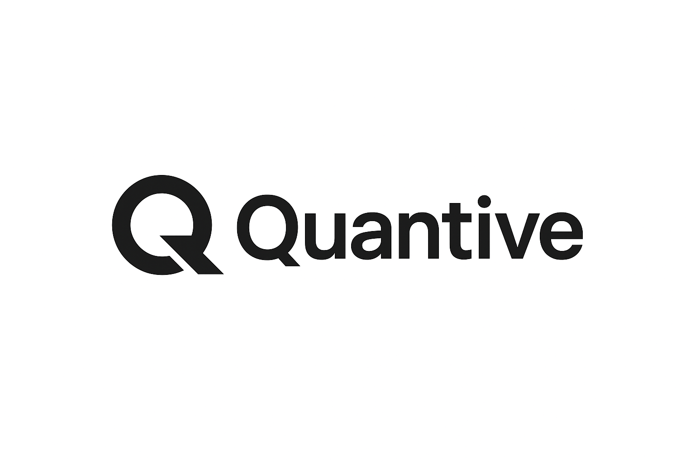

<!-- Company introduction -->

  

---

## About Us

Quantive is an international technology company specializing in **quantitative trading, financial services, AI-powered software development, and blockchain technology**. We strive to deliver innovative, professional, and efficient financial technology platforms that empower clients to achieve superior results in a data-driven world.

---

## Our Mission

- Harness advanced AI and data analytics to improve trading decisions  
- Build scalable and reliable quantitative trading platforms  
- Drive fintech innovation and create global impact  

---

## Core Values

| Innovation | Professionalism | Global Vision | Trustworthiness |
|:---------:|:---------------:|:------------:|:--------------:|
| Continuously explore cutting-edge technology | Focused on finance, blockchain, and software development | Expand market reach with an international perspective | Deliver stable, secure, and reliable solutions |

---

## Our Services

1. Quantitative trading strategy development  
2. Financial data analysis and risk management models  
3. API integration and software development for financial systems  
4. AI-driven trading and automation tools  
5. P2P communication applications for share your result to your friend 

---

## Contact Us

- 📍 Address:Xinyi District, Taipei, Taiwan  

---

> “Making trading smarter and more secure with AI and blockchain.”  
> — The Quantive Team
